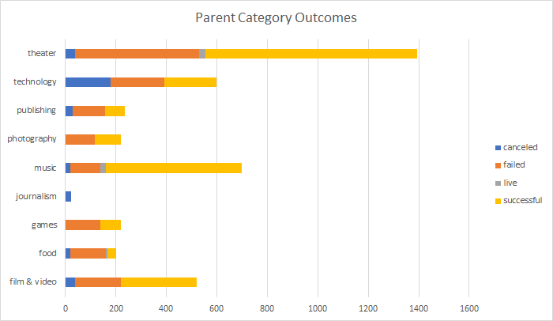
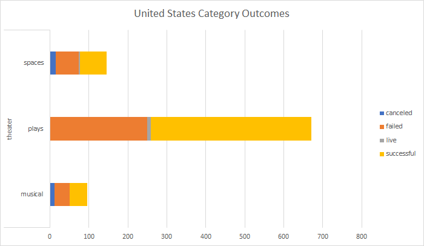
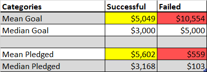
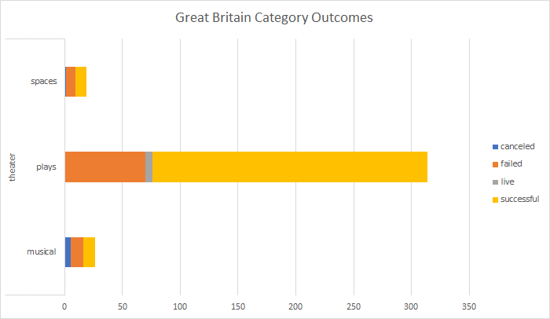
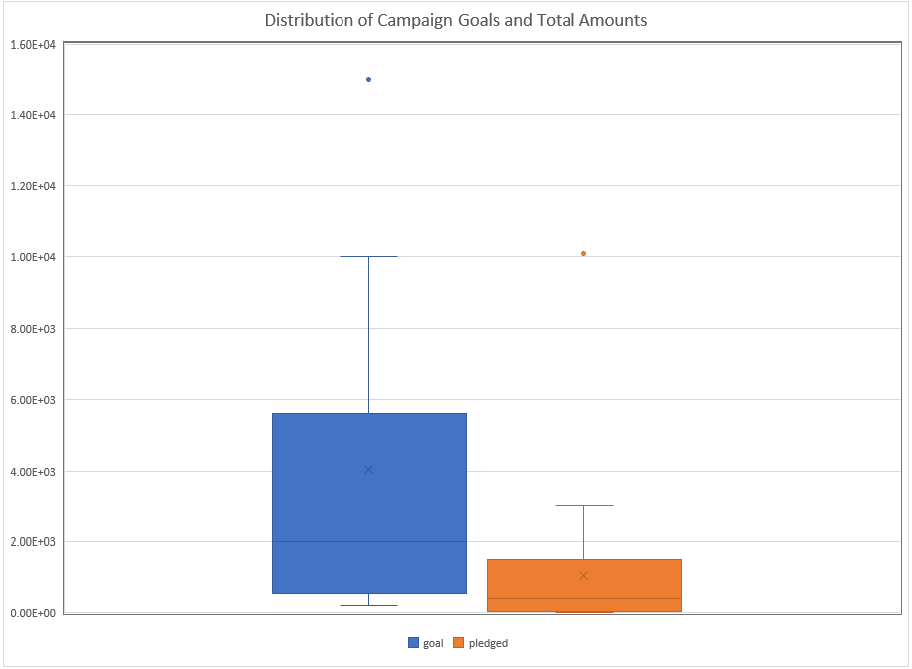

# An Analysis of Kickstarter Campaigns

## Brief Description

An Analysis performed on Kickstarter data to help ensure the crowdfunding campaign is successful to fund the play _Fever_. The estimate **budget** for the play is around $10,000.

### Analysis

With the data that was given, it shows successful outcomes in several countries. Theater had the most successful outcomes out of the other industries. Since your main focus is in **United States** and **Great Britain**, the focus on this report will be of those two countries.

As showed in the chart below, the majority of the successful outcomes were plays in the US.

As shown in the table below, the average (mean) of successful plays' goals were less than the ones that failed. It was roughly half of the failed goal. The mean of the successful plays' pledged was significantly higher than the ones that failed. The failed kickstarters may have had extremely high goals. However, the mean and median pledged amount is significantly less than the successful ones which indicate there were other reasoning besides the higher goal amount that contributed to the failure.

Similar to the United States, the majority of the successful outcomes were plays.

Researched five plays at the **Edinburgh Festival Fringe**. Shown on the table below, these five plays were successful. _Be Prepared_ had a goal of 2000. With 39 Backers donating an average of 51.79, the campaign was successful. However _Cutting Off Kate Bush_ had a goal less than that. 78 backers donating an average of 33.03. There is missing information on why is that. One can conclude the type of play could have been a contributing factor to the number of backers.

Creating a musical project with an estimated budget of £4,000 in Great Britain is of interest. The research was also done on Great Britain's musicals. Musicals were not as successful as plays. It had roughly the same amount of success as failures. (Shown in Great Britain Category Outcomes Chart)

The chart above is the distribution of Great Britain's musical campaign. The average(mean) of the campaign goal is roughly £4,000 which is higher than the mean of the pledged (less than £2,000). Half of the goal is less than £2,000. 25% of the campaigns of musicals did not get any funding at all.

---
### Challenge

Most successful plays had a goal less than 5000. On the other hand, most failures were greater than 45,000. There wasn't any canceled plays.

Most successful Kickstarter started in May and June while most failure started in December.

## Conclusion

In conclusion, the timing of the play and the budget are very important criteria.  Recommend reducing the campaign's budget. Start a campaign in May. Although having a higher goal is a contributing factor for the failure, data proves that there may be other unknown factors that contribute to the failures.
